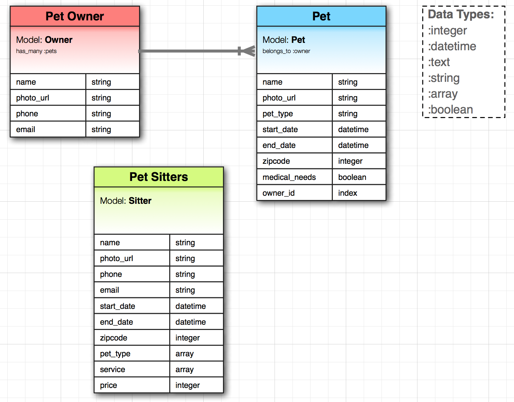

# Description

This site was built to provide a community for pet owners and pet sitters to find each other. Two-way data binding provides responsive search queries. We have three models (pet sitter, pet owner and pet) with pet owner and pet having a one to many relationship. In our application a pet owner is able to search for pet sitters by name and location(zipcode) by using a text search or a drop down list. A pet sitter is able to search by location and type of pet. We also included a filter to include or not include a pet that will need to be given medication.

Before building our application we created an entity-relationship diagram (ERD) to map out all of the model entities. We then created our database using rails and hard coded the seed data.

You can check out the site here: [Fetch](http://scottpierce-wrobel.com/fetch/#/).

