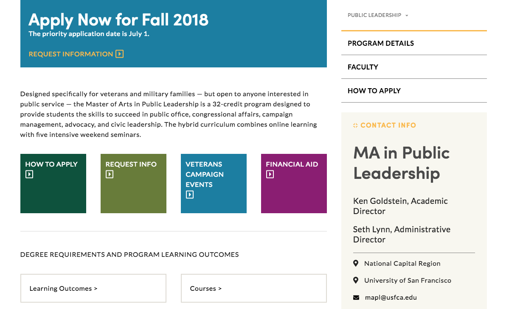

# Description

This is the second project I have built for Veterans Campaign after they initially hired me back in 2014. They partnered with the University of San Francisco and needed ten new custom coded pages to advertise their new Master of Arts program.

I had a fun time on this project exploring the depth of css possibilities using Squarespace code blocks. They had strict design standards that needed to be adhered to.

You can check out the site here: [Master of Arts in Public Leadership](http://www.veteranscampaign.org/masters).

