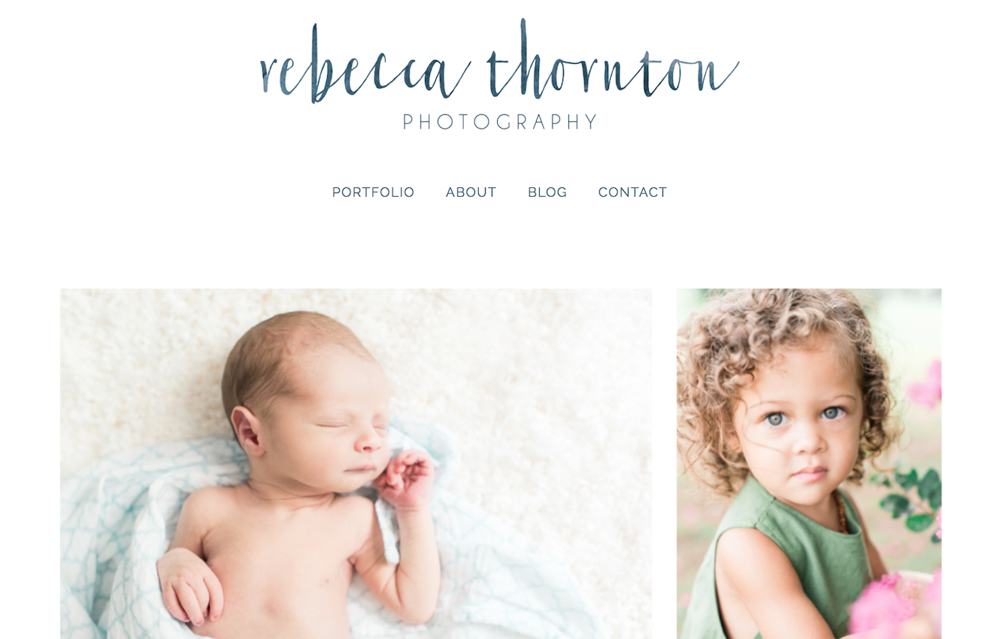

# Description

I enjoy helping entrepreneurs grow their business and attract wider audiences. It is fun to work with people that are as passionate about their work as I am about building beautiful websites. This site was built on Squarespace and customized past the out of the box features using code injections and code blocks to give Rebecca the exact user experience she wanted.

For this project, I consolidated the domain name registrar, hosting platform and website all onto Squarespace. I migrated all of the past blog posts from an old WordPress site while maintaining consistent URL slugs to ensure a seamless transition for SEO rankings.

You can check out the site here: [Rebecca Thornton Photography](https://www.rebeccathorntonphotography.com/).

